**I see problems as opportunities. I build solutions. I ship products.**

Data and applied AI, in public. Understanding is built, not read - so I build the course,
the tool, the teardown, and publish every one of them.

<!-- STATS:START -->
**78 free courses** live right now, **1026 sessions** across **12 domains**, on **87 live sites**. Everything below is free and runs in a browser.
<!-- STATS:END -->

---

### Start anywhere

| | What it is | Open it |
| --- | --- | --- |
| 📚 | **Free, hands-on courses** on AI, data, and the craft around them. Two tracks: leaders who need to decide, builders who need to ship. | [learn-with-phoebe ↗](https://phoebefu6.github.io/learn-with-phoebe/) |
| 🔬 | **Which AI agent Skills survive a real build.** Each one field-tested by building a product from scratch, rated on a public rubric, every demo open. | [agent-skills-phoebe-picks ↗](https://phoebefu6.github.io/agent-skills-phoebe-picks/) |
| 🧰 | **Data skills you can install, not just read.** Real runs on real rows, flaws planted on purpose, and a review pass that rewrites the code. | [phoebe-data-skills ↗](https://phoebefu6.github.io/phoebe-data-skills/) |
| 🚢 | **What I ship.** The build log. | [phoebe-the-builder ↗](https://phoebefu6.github.io/phoebe-the-builder/) |
| 🎨 | **Data and AI, explained in pictures.** Decoded concepts, teaching comics, style lab. Every prompt published. | [sketch-ideas-with-phoebe ↗](https://phoebefu6.github.io/sketch-ideas-with-phoebe/) |

---

<!-- HIGHLIGHTS:START -->
**📘 Today from the shelf** · [AI + Research](https://phoebefu6.github.io/learn-ai-research-with-phoebe/)
Two tracks on research you can defend - the 6-session leader track sets the shared evidence standard, the failure catalogue, the consent rails and how...
<!-- HIGHLIGHTS:END -->

---

<picture>
  <source media="(prefers-color-scheme: dark)"
          srcset="https://raw.githubusercontent.com/phoebefu6/phoebefu6/output/snake-dark.svg">
  <source media="(prefers-color-scheme: light)"
          srcset="https://raw.githubusercontent.com/phoebefu6/phoebefu6/output/snake-light.svg">
  
</picture>

---

The counts and highlights on this page are generated daily from the live repos, never typed by hand.
